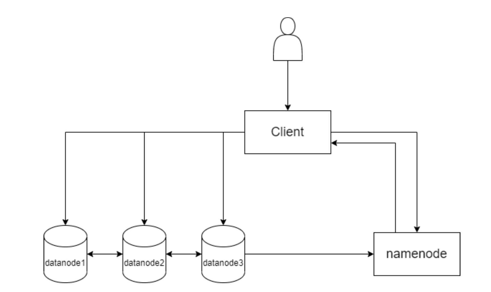

# FileWave Distributed File Storage System

This project is based on the Go language and the ProtoBuf&gRPC communication protocol. Please refers to the GFS framework to complete a simple distributed storage system, uses Raft to implement the consistency consensus module of the metadata service.

## Project Structure

The distributed storage system designed by our team refers to the traditional GFS design. The basic structure is divided into three blocks, namely client, namenode, and datanode.

- **clinent**It is mainly responsible for interacting directly with users. It is the relevant universal interface of the user's use items to obtain, manage, and store data.
- **namenode**Mainly responsible for the management of metadata, it is the core of the entire system management. Any data reading and storage needs to be processed through the namenode. In order to reduce the complexity of the overall project, the entire project has only one working namenode. Detailed process design This will be explained in the development documentation.
- **datanode**Mainly responsible for data storage. The datanode of this project is designed to be similar to the chunk design of GFS, which is reflected as a block in the code. Each datanode has several blocks, and each bolt will store part of the file content, achieving the effect of multi-copy storage and distributed storage of files.

**Universal interface design**

- **Put(localilePath, remoteFilePath string) Result**Transfer local files to the storage system.
- **Get(remoteFilePath, localFilePath string) Result**Pull files from the storage system to local.
- **Delete(remoteFilePath string) Result**Delete files from storage system.
- **Stat(remoteFilePath string) Result**Get the metadata of the target file in the storage system.
- **Mkdir(remoteFilePath string) Result**Create a path in the storage system.
- **Rename(renameSrcPath, renameDestPath string) Result**Rename the file path in the system.
- **List(remoteDirPath string) Result**Get metadata under the target folder in the storage system.

